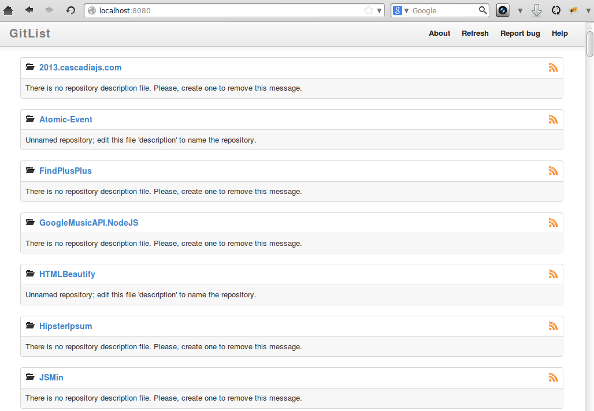

# vagrant-gitlist

Plug and play [Vagrantfile][Vagrant] for [GitList][]

[Vagrant]: http://www.vagrantup.com/
[GitList]: http://gitlist.org/



## Getting Started
Install [Vagrant][] as instructed by http://www.vagrantup.com/

Clone the repository via `git`

```bash
git clone https://github.com/twolfson/vagrant-gitlist
```

Modify the `Vagrantfile` to display your repositories folder

```bash
cd vagrant-gitlist
pico Vagrantfile
# Update the following line
# config.vm.synced_folder "path/to/my/repos", "/var/www/projects"
# Example:
# config.vm.synced_folder "/home/todd/github", "/var/www/projects"
```

Launch the Vagrant instance

```bash
vagrant up
# Bringing machine 'default' up with 'virtualbox' provider...
```

When the instance is complete, you should be able to access your GitList instance at

[http://localhost:8080/](http://localhost:8080/)

## Contributing
In lieu of a formal styleguide, take care to maintain the existing coding style.

## Donating
Support this project and [others by twolfson][gittip] via [gittip][].

[![Support via Gittip][gittip-badge]][gittip]

[gittip-badge]: https://rawgithub.com/twolfson/gittip-badge/master/dist/gittip.png
[gittip]: https://www.gittip.com/twolfson/

## Unlicense
As of Jan 28 2014, Todd Wolfson has released this repository and its contents to the public domain.

It has been released under the [UNLICENSE][].

[UNLICENSE]: UNLICENSE
